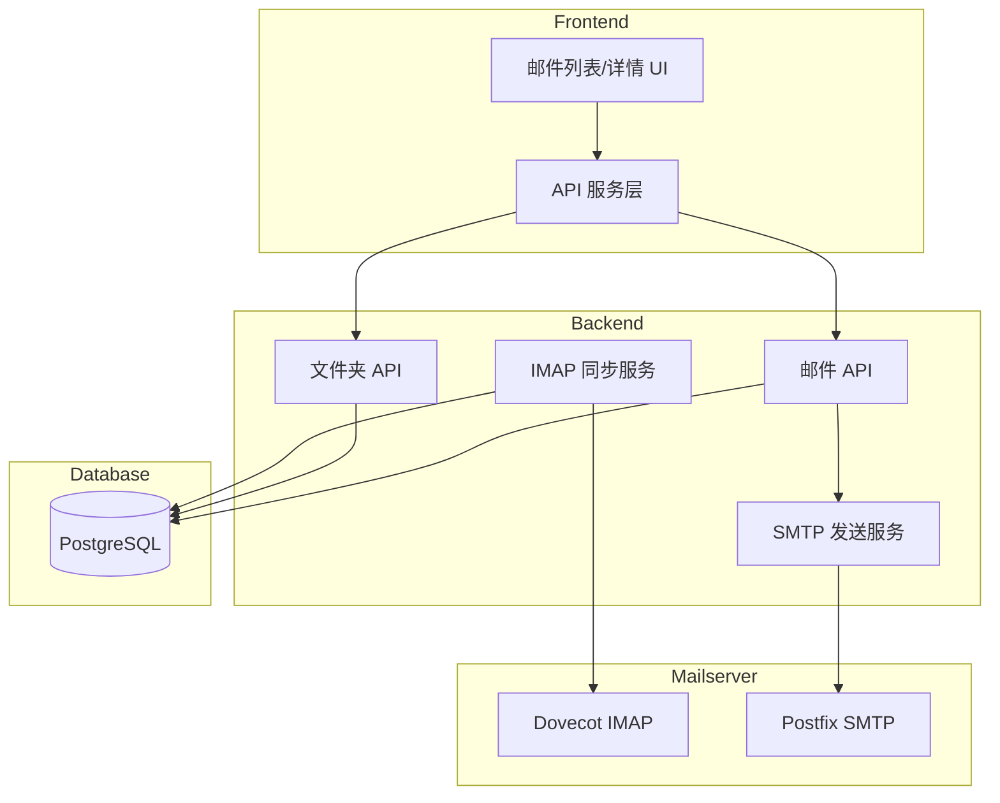
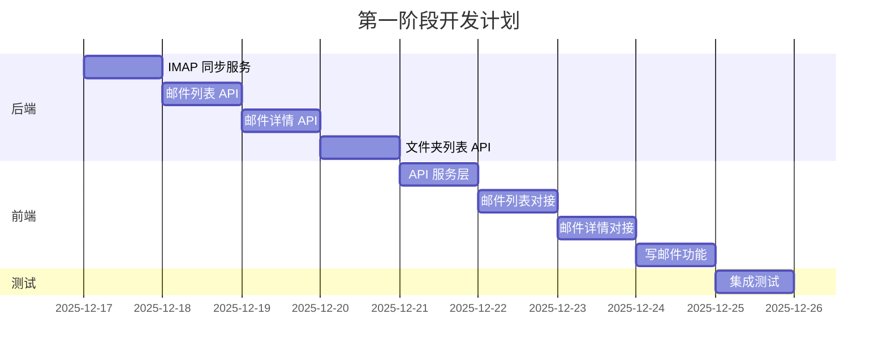

# 第一阶段开发计划：核心邮件闭环

## 目标
让前端能够真正收发邮件，替换掉模拟数据。

## 架构概览



---

## 任务 1: IMAP 邮件同步服务

### 设计思路
- 用户登录时或定时触发，从 Dovecot 拉取新邮件
- 解析邮件内容，存入 PostgreSQL
- 使用 Message-ID 去重，避免重复导入

### 文件结构
```
backend/core/
├── mail.py          # 现有 SMTP 发送
└── imap_sync.py     # 新增 IMAP 同步
```

### 核心代码设计

```python
# backend/core/imap_sync.py
import imaplib
import email
from email.header import decode_header
from db.models import Email, Folder
from sqlalchemy.orm import Session

class IMAPSyncService:
    def __init__(self, host: str, port: int = 993):
        self.host = host
        self.port = port
    
    def sync_user_inbox(self, db: Session, user_email: str, password: str, user_id: int):
        # 1. 连接 IMAP
        # 2. 获取收件箱邮件列表
        # 3. 对比数据库，找出新邮件
        # 4. 解析并存储新邮件
        pass
    
    def _parse_email(self, raw_email: bytes) -> dict:
        # 解析邮件头和正文
        pass
```

### 关键点
- 使用 `imaplib.IMAP4_SSL` 连接 (端口 993)
- 开发环境可用 `IMAP4` 无 SSL (端口 143)
- 通过 `Message-ID` 判断邮件是否已存在

---

## 任务 2: 邮件列表 API

### Endpoint
`GET /talent/emails`

### 查询参数
| 参数 | 类型 | 说明 |
|------|------|------|
| folder_id | int | 文件夹 ID (必填) |
| page | int | 页码，默认 1 |
| limit | int | 每页数量，默认 50 |
| is_read | bool | 筛选已读/未读 |
| is_starred | bool | 筛选星标 |

### 响应示例
```json
{
  "status": "success",
  "data": {
    "items": [
      {
        "id": 1,
        "subject": "欢迎使用 TalentMail",
        "sender": "admin@talenting.test",
        "snippet": "这是您的第一封邮件...",
        "received_at": "2025-12-17T10:30:00Z",
        "is_read": false,
        "is_starred": true,
        "has_attachments": false
      }
    ],
    "total": 1,
    "page": 1,
    "limit": 50
  }
}
```

---

## 任务 3: 邮件详情 API

### Endpoint
`GET /talent/emails/{email_id}`

### 响应示例
```json
{
  "status": "success",
  "data": {
    "id": 1,
    "subject": "欢迎使用 TalentMail",
    "sender": "admin@talenting.test",
    "recipients": {
      "to": [{"name": "User", "email": "user@talenting.test"}],
      "cc": [],
      "bcc": []
    },
    "body_html": "<h1>欢迎</h1><p>这是正文...</p>",
    "body_text": "欢迎\n这是正文...",
    "received_at": "2025-12-17T10:30:00Z",
    "is_read": true,
    "is_starred": true,
    "attachments": []
  }
}
```

### 副作用
- 访问详情时自动标记为已读

---

## 任务 4: 文件夹列表 API

### Endpoint
`GET /talent/folders`

### 响应示例
```json
{
  "status": "success",
  "data": [
    {"id": 1, "name": "收件箱", "role": "inbox", "unread_count": 5},
    {"id": 2, "name": "已发送", "role": "sent", "unread_count": 0},
    {"id": 3, "name": "草稿", "role": "drafts", "unread_count": 2},
    {"id": 4, "name": "垃圾箱", "role": "trash", "unread_count": 0},
    {"id": 5, "name": "垃圾邮件", "role": "spam", "unread_count": 0},
    {"id": 6, "name": "归档", "role": "archive", "unread_count": 0}
  ]
}
```

---

## 任务 5-7: 前端 API 对接

### API 服务层设计

```typescript
// frontend/app/services/api.ts
const API_BASE = '/talent'

export const emailApi = {
  list: (folderId: number, params?: {page?: number, limit?: number}) => 
    $fetch(`${API_BASE}/emails`, { params: { folder_id: folderId, ...params } }),
  
  get: (id: number) => 
    $fetch(`${API_BASE}/emails/${id}`),
  
  send: (data: EmailCreate) => 
    $fetch(`${API_BASE}/emails/send`, { method: 'POST', body: data }),
}

export const folderApi = {
  list: () => $fetch(`${API_BASE}/folders`),
}
```

### useEmails composable 改造

```typescript
// frontend/app/composables/useEmails.ts
export const useEmails = () => {
  const emails = useState<Email[]>('emails', () => [])
  const selectedEmailId = useState<number | null>('selectedEmailId', () => null)
  const currentFolderId = useState<number>('currentFolderId', () => 1) // inbox
  const loading = useState('emailsLoading', () => false)
  
  const fetchEmails = async (folderId: number) => {
    loading.value = true
    try {
      const res = await emailApi.list(folderId)
      emails.value = res.data.items
    } finally {
      loading.value = false
    }
  }
  
  const selectedEmail = computed(() => 
    emails.value.find(e => e.id === selectedEmailId.value)
  )
  
  return { emails, selectedEmailId, selectedEmail, currentFolderId, loading, fetchEmails }
}
```

---

## 任务 8: 写邮件功能完善

### 现有组件
- `frontend/app/components/email/ComposeModal.vue`

### 需要完善
1. 收件人输入 (支持多个)
2. 主题输入
3. 富文本编辑器 (可先用 textarea)
4. 发送按钮调用 API
5. 发送成功后关闭弹窗并刷新列表

---

## 任务 9: 集成测试

### 测试流程
1. 用 admin@talenting.test 登录
2. 查看收件箱 (应该能看到之前测试发送的邮件)
3. 点击邮件查看详情
4. 发送新邮件给自己
5. 刷新收件箱，确认收到新邮件

---

## 实现顺序



---

## 开始实现

准备好后，切换到 Code 模式开始实现第一个任务：IMAP 邮件同步服务。