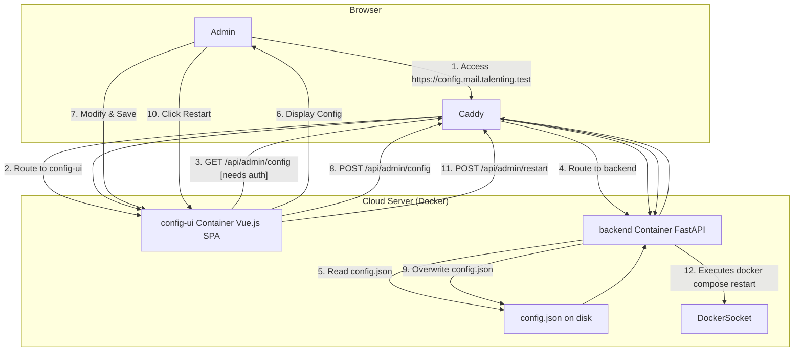

# TalentMail 项目开发计划与技术方案 V10

## 1. 核心理念

遵循您提出的"零硬编码"、"完整实现"、"代码即法律"和"不留烂摊子"四大原则。我们优先构建一个稳定、可测试的核心 MVP（最小可行产品），然后在此基础上逐步扩展功能，确保每一步都坚实可靠。

## 2. 技术栈总览

- **前端 (主应用)**:
  - **框架**: Nuxt.js 3 (基于 Vue.js 3)
  - **UI 库**: Tailwind CSS
  - **语言**: TypeScript
- **前端 (配置后台)**:
  - **框架/工具**: Vue.js 3 + Vite
  - **UI 库**: Tailwind CSS
  - **语言**: JavaScript/TypeScript
- **后端 (Backend)**:
  - **框架**: FastAPI
  - **语言**: Python 3
  - **数据验证**: Pydantic V2
  - **数据库 ORM**: SQLAlchemy
- **数据库 (Database)**:
  - PostgreSQL
- **DevOps & 部署**:
  - **容器化**: Docker, Docker Compose
  - **Web 服务器 / 反向代理**: Caddy
  - **邮件服务 (开发/生产环境)**: **docker-mailserver (一体化邮件服务器)**

## 3. 项目目录结构

```
/home/talent/projects/talentmail
├── .env                  # 存储敏感密钥 (数据库密码, JWT密钥等)
├── config.json           # 项目核心配置文件 (单一事实来源)
├── docker-compose.dev.yml # 开发环境 Docker 编排
├── docker-compose.yml    # 生产环境 Docker 编排 (待完善)
├── backend/              # 后端 FastAPI 应用
│   ├── Dockerfile
│   ├── main.py             # 应用入口
│   ├── requirements.txt
│   ├── api/                # API 路由层
│   │   ├── auth.py
│   │   └── mail.py
│   ├── core/               # 核心逻辑 (配置, 安全, 邮件服务)
│   │   ├── config.py
│   │   ├── security.py
│   │   └── mail.py
│   ├── crud/               # 数据库操作层 (CURD)
│   │   ├── user.py
│   │   └── email.py
│   ├── db/                 # 数据库模型和会话管理
│   │   ├── database.py
│   │   └── models.py
│   ├── schemas/            # Pydantic 数据模型
│   │   └── schemas.py
│   ├── utils/              # 后端工具函数
│   └── initial/            # 初始数据脚本
│       └── initial_data.py
├── frontend/             # 前端 Nuxt.js 应用
│   ├── Dockerfile
│   ├── nuxt.config.ts
│   ├── package.json
│   └── app/                # Nuxt 应用源码
│       ├── pages/            # 页面组件
│       ├── components/       # 可复用组件
│       ├── layouts/          # 布局
│       └── utils/            # 前端工具函数 (如 axios 封装)
├── config-ui/            # 独立的可视化配置前端应用
│   ├── Dockerfile
│   ├── vite.config.ts
│   ├── package.json
│   └── src/
├── config/               # 配置文件目录
│   ├── caddy/              # Caddy 配置
│   └── mail/               # 邮件服务器配置
│       └── development/
│           └── mailserver.env
├── data/                 # 数据持久化目录
│   └── mailserver/         # 邮件服务器数据
│       ├── mail-data/        # 邮件存储
│       ├── mail-state/       # 服务状态
│       ├── mail-logs/        # 日志
│       └── config/           # 运行时配置
├── scripts/              # 辅助脚本
│   └── sync_users_to_mailserver.py
└── note/                 # 文档与规划
    └── PLAN.md
```

## 4. 开发阶段规划

### **第一阶段：核心 MVP - 单用户完整邮件闭环 (当前)**

- **任务 1.1**: [已完成] `crud` 层架构重构。
- **任务 1.2**: [已完成] **用户初始化**：新用户注册后，自动创建 6 个标准邮件文件夹。
- **任务 1.3**: [进行中] **开发环境邮件收发测试**：验证 docker-mailserver 的完整邮件收发功能。
- **任务 1.4**: **核心用户 API**：实现 `GET /api/users/me` 端点。
- **任务 1.5**: **核心邮件功能**：实现邮件发送 (`POST /api/emails/`)、已发送邮件记录、邮件列表 (`GET /api/emails/`)。
- **任务 1.6**: **邮件接收功能**：实现通过 IMAP 从 mailserver 读取邮件的功能。
- **任务 1.7**: **本地邮件收发闭环测试**：创建测试脚本验证完整的邮件收发流程。

### **第二阶段：核心邮件功能扩展**

- **任务 2.1**: **邮件管理**：实现邮件详情查看、批量操作（移动、标记等）、草稿功能。
- **任务 2.2**: **文件夹与联系人**：支持自定义文件夹和基础的联系人管理。
- **任务 2.3**: **高级搜索**：支持更复杂的搜索语法。

### **第三阶段：高级效率与追踪功能**

- **任务 3.1**: **邮件追踪**：实现邮件打开和链接点击追踪。
- **任务 3.2**: **效率工具**：实现邮件定时发送和邮件模板。

### **第四阶段：生产环境与管理后台**

- **任务 4.1**: **生产环境邮件服务**：配置生产环境的 docker-mailserver，包括 DNS 记录、SSL 证书等。
- **任务 4.2**: **可视化配置后台**：实现独立的配置管理 UI 和 API。
- **任务 4.3**: **生产环境部署**：完善 `docker-compose.yml`，编写部署文档和监控方案。

---

## 5. 核心技术方案

### **方案 A：邮件收发系统 (统一使用 docker-mailserver)**

#### 为什么选择 docker-mailserver？

**docker-mailserver** 是一个功能完整的一体化邮件服务器解决方案，包含：

| 组件 | 功能 |
|------|------|
| **Postfix** | SMTP 邮件传输代理 (MTA) - 负责发送和接收邮件 |
| **Dovecot** | IMAP/POP3 服务器 - 让用户读取邮件 |
| **SpamAssassin** | 垃圾邮件过滤 |
| **ClamAV** | 病毒扫描 |
| **OpenDKIM** | DKIM 邮件签名 |
| **Fail2ban** | 安全防护 |
| **Postgrey** | 灰名单反垃圾邮件 |

**为什么不单独使用 Postfix？**
- Postfix 只是 MTA，只能发送和接收邮件到服务器
- 用户无法通过 IMAP/POP3 读取邮件
- 需要额外配置 Dovecot、SpamAssassin 等组件
- docker-mailserver 已经集成了所有这些组件，开箱即用

#### 完整邮件流程

```
┌─────────────────────────────────────────────────────────────────────────────┐
│                        TalentMail 邮件系统架构                                │
├─────────────────────────────────────────────────────────────────────────────┤
│                                                                             │
│  ┌─────────────────────────────────────────────────────────────────────┐   │
│  │                    docker-mailserver 容器                            │   │
│  │  ┌─────────────┐  ┌─────────────┐  ┌─────────────┐  ┌────────────┐  │   │
│  │  │   Postfix   │  │   Dovecot   │  │ SpamAssassin│  │   ClamAV   │  │   │
│  │  │  (SMTP)     │  │ (IMAP/POP3) │  │  (反垃圾)   │  │  (杀毒)    │  │   │
│  │  └─────────────┘  └─────────────┘  └─────────────┘  └────────────┘  │   │
│  │  ┌─────────────┐  ┌─────────────┐  ┌─────────────┐                  │   │
│  │  │  OpenDKIM   │  │  Fail2ban   │  │  Postgrey   │                  │   │
│  │  │  (签名)     │  │  (安全)     │  │  (灰名单)   │                  │   │
│  │  └─────────────┘  └─────────────┘  └─────────────┘                  │   │
│  └─────────────────────────────────────────────────────────────────────┘   │
│                                                                             │
│  邮件发送流程:                                                               │
│  FastAPI ──SMTP(587)──► Postfix ──► 外部邮件服务器                          │
│                                                                             │
│  邮件接收流程:                                                               │
│  外部邮件服务器 ──SMTP(25)──► Postfix ──► Dovecot ──► 邮件存储              │
│                                                                             │
│  邮件读取流程:                                                               │
│  FastAPI ──IMAP(993)──► Dovecot ──► 获取邮件内容                            │
│                                                                             │
└─────────────────────────────────────────────────────────────────────────────┘
```

#### 开发环境配置

```yaml
# docker-compose.dev.yml 中的 mailserver 服务
mailserver:
  image: docker.io/mailserver/docker-mailserver:latest
  container_name: talentmail-mailserver-1
  hostname: maillink.talenting.test
  env_file: ./config/mail/development/mailserver.env
  environment:
    - PERMIT_DOCKER=network
  ports:
    - "25:25"    # SMTP (接收外部邮件)
    - "143:143"  # IMAP (明文)
    - "587:587"  # SMTP Submission (发送邮件)
    - "993:993"  # IMAPS (加密)
  volumes:
    - ./data/mailserver/mail-data/:/var/mail/
    - ./data/mailserver/mail-state/:/var/mail-state/
    - ./data/mailserver/mail-logs/:/var/log/mail/
    - ./data/mailserver/config/:/tmp/docker-mailserver/
```

#### 生产环境配置

生产环境同样使用 docker-mailserver，但需要额外配置：

1. **SSL/TLS 证书** - 使用 Let's Encrypt
2. **DNS 记录** - MX、SPF、DKIM、DMARC
3. **反向 DNS (rDNS)** - 防止被标记为垃圾邮件
4. **IP 信誉** - 确保服务器 IP 不在黑名单中

### **方案 A.1：生产环境 DNS 配置要求**

要让邮件服务器正常工作，需要配置以下 DNS 记录：

#### 1. MX 记录 (邮件交换记录)
```
类型: MX
主机: @
值: maillink.talenting.vip
优先级: 10
```

#### 2. A 记录 (邮件服务器 IP)
```
类型: A
主机: maillink
值: <你的服务器IP>
```

#### 3. SPF 记录 (发件人策略框架)
```
类型: TXT
主机: @
值: v=spf1 mx a:maillink.talenting.vip ~all
```

#### 4. DKIM 记录 (域名密钥识别邮件)
```
类型: TXT
主机: mail._domainkey
值: v=DKIM1; k=rsa; p=<公钥内容>
```
> 公钥由 docker-mailserver 自动生成，位于 `data/mailserver/config/opendkim/keys/`

#### 5. DMARC 记录 (基于域的消息认证)
```
类型: TXT
主机: _dmarc
值: v=DMARC1; p=quarantine; rua=mailto:admin@talenting.vip
```

#### 6. 反向 DNS (rDNS/PTR 记录)
```
需要联系 VPS 提供商设置
IP: <你的服务器IP>
PTR: maillink.talenting.vip
```

### **方案 A.2：FastAPI 与邮件服务器的交互**

#### 发送邮件 (SMTP)
```python
# backend/core/mail.py
import smtplib
from email.mime.text import MIMEText

async def send_email(email_data, sender_email):
    server = smtplib.SMTP(settings.MAIL_SERVER, settings.SMTP_PORT)
    if settings.MAIL_STARTTLS:
        server.starttls()
    if settings.USE_CREDENTIALS:
        server.login(settings.MAIL_USERNAME, settings.MAIL_PASSWORD)
    server.sendmail(from_addr, recipients, msg.as_string())
    server.quit()
```

#### 接收/读取邮件 (IMAP) - 待实现
```python
# backend/core/mail.py (待添加)
import imaplib
import email

async def fetch_emails(user_email, password, folder="INBOX"):
    """通过 IMAP 从 mailserver 获取邮件"""
    imap = imaplib.IMAP4_SSL(settings.MAIL_SERVER, 993)
    imap.login(user_email, password)
    imap.select(folder)
    
    # 搜索邮件
    status, messages = imap.search(None, "ALL")
    email_ids = messages[0].split()
    
    emails = []
    for email_id in email_ids:
        status, msg_data = imap.fetch(email_id, "(RFC822)")
        raw_email = msg_data[0][1]
        email_message = email.message_from_bytes(raw_email)
        emails.append(parse_email(email_message))
    
    imap.logout()
    return emails
```

### **方案 B：可视化配置后台 (最终方案)**

我们将创建一个独立的、受保护的"配置微服务"，它由一个轻量级 Vue 前端和一个专属的后端 API 组成。

- **工作流程**:
    1.  **部署**: `config-ui` 作为独立的 Docker 服务，与主应用一同启动。Caddy 负责将 `config.mail.talenting.test` 域名指向该服务。
    2.  **访问与修改**: 管理员通过该域名访问，登录后，页面通过 `GET /api/admin/config` 获取配置。保存时，通过 `POST /api/admin/config` 将修改后的数据提交给后端。
    3.  **重启**: 页面提供"重启"按钮，调用后端的 `POST /api/admin/restart` 接口，由后端执行 `docker compose restart` 命令来应用配置。
- **后端 API**:
    -   `GET /api/admin/config`: 读取并返回 `config.json`。 (需管理员权限)
    -   `POST /api/admin/config`: 验证并覆写 `config.json`。 (需管理员权限)
    -   `POST /api/admin/restart`: 触发应用重启。 (需管理员权限)

- **架构图 (Mermaid)**:


---

## 6. 邮件系统端口说明

| 端口 | 协议 | 用途 | 加密 |
|------|------|------|------|
| 25 | SMTP | 接收外部邮件服务器发来的邮件 | 可选 STARTTLS |
| 587 | SMTP Submission | 用户/应用发送邮件 | STARTTLS |
| 465 | SMTPS | 用户/应用发送邮件 (隐式 TLS) | TLS |
| 143 | IMAP | 读取邮件 | 可选 STARTTLS |
| 993 | IMAPS | 读取邮件 (隐式 TLS) | TLS |
| 110 | POP3 | 读取邮件 (下载后删除) | 可选 STARTTLS |
| 995 | POP3S | 读取邮件 (隐式 TLS) | TLS |

---

## 7. 下一步行动

1. **完成开发环境邮件收发测试** - 验证 docker-mailserver 的完整功能
2. **实现 IMAP 邮件读取功能** - 让 FastAPI 能够从 mailserver 获取邮件
3. **完善前端邮件列表** - 显示收到的邮件
4. **准备生产环境部署** - 配置 DNS 记录和 SSL 证书