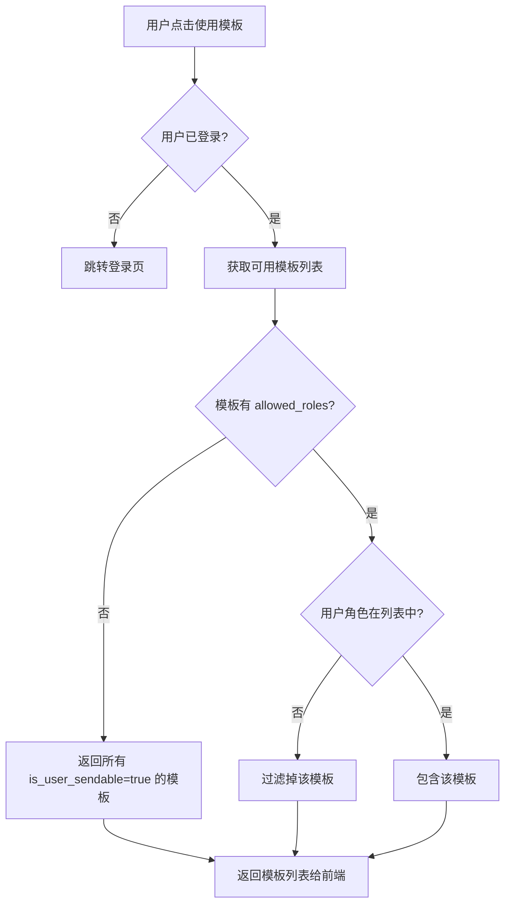

# TalentMail 邮件模板系统优化设计方案

## 一、背景与目标

### 1.1 当前状态分析

**已有优势：**
- 变量结构已支持双语：`key`（英文变量名）+ `label`（中文显示名称）
- 模板元数据定义完善：包含 `trigger_description`（触发时机说明）
- 全局变量支持三种类型：`static`、`dynamic`、`config`

**存在问题：**
1. 模板功能仅面向管理员（在设置页面 → 邮件模板）
2. 普通用户（如财务）无法使用预设模板发送邮件
3. ComposeModal 是纯手动输入，没有模板选择功能
4. 前端变量展示未充分利用 `label` 中文名称

### 1.2 设计目标

1. **让非开发人员能方便使用预设模板发送邮件**
   - 财务人员可以选择"发票通知"模板，只需填写变量值即可发送
   - HR 可以选择"入职欢迎"模板发送给新员工
   
2. **增强变量的可理解性**
   - 在所有界面中显示中文 `label`
   - 变量输入时提供示例和说明

3. **保持系统模板与用户模板的分离**
   - 系统模板：验证码、密码重置等（自动触发，用户不能手动发送）
   - 业务模板：财务通知、HR 通知等（用户可手动使用）

---

## 二、数据结构设计

### 2.1 现有变量结构（保持不变）

```typescript
// 模板变量定义
interface TemplateVariable {
  key: string       // 英文变量名（用于渲染引擎），如 "invoice_number"
  label: string     // 中文显示名称，如 "发票号码"
  type: string      // 变量类型：string | number | url | datetime | email
  example: string   // 示例值，如 "FP-2024-001234"
  required: boolean // 是否必填
  description?: string // 详细说明（可选）
}
```

### 2.2 新增业务模板分类

在 `category` 字段扩展支持以下分类：

```python
TEMPLATE_CATEGORIES = {
    # 现有分类（系统自动触发）
    "auth": "认证相关",           # 验证码、密码重置
    "notification": "系统通知",    # 存储警告、登录提醒
    "collaboration": "协作分享",   # 文件分享、邀请注册
    
    # 新增分类（用户可手动使用）
    "finance": "财务通知",         # 发票、付款、报销
    "hr": "人事通知",             # 入职、考勤、假期
    "marketing": "营销推广",       # 促销、活动、新品
    "customer": "客户服务",        # 工单回复、满意度调查
    "custom": "自定义模板",        # 用户自己创建的模板
}
```

### 2.3 模板元数据扩展

在 `TemplateMetadata` 表中新增字段：

```python
class TemplateMetadata(Base):
    # ... 现有字段 ...
    
    # 新增字段
    is_user_sendable = Column(Boolean, default=False, 
        comment="是否允许用户手动使用此模板发送邮件")
    allowed_roles = Column(JSON, default=list, 
        comment="允许使用的角色列表，空表示所有人")
    icon = Column(String(50), nullable=True, 
        comment="模板图标（Emoji 或图标名称）")
    usage_count = Column(Integer, default=0, 
        comment="使用次数统计")
```

---

## 三、业务模板示例

### 3.1 财务模板示例

```python
{
    "code": "invoice_notification",
    "name": "发票开具通知",
    "category": "finance",
    "is_user_sendable": True,
    "allowed_roles": ["admin", "finance"],
    "icon": "📄",
    "description": "通知客户发票已开具，提供发票详情和下载链接",
    "trigger_description": "财务人员在开具发票后手动发送",
    "variables": [
        {"key": "customer_name", "label": "客户名称", "type": "string", "example": "张三", "required": True},
        {"key": "invoice_number", "label": "发票号码", "type": "string", "example": "FP-2024-001234", "required": True},
        {"key": "invoice_amount", "label": "发票金额", "type": "number", "example": "12800.00", "required": True},
        {"key": "invoice_date", "label": "开票日期", "type": "datetime", "example": "2024-12-30", "required": True},
        {"key": "download_url", "label": "下载链接", "type": "url", "example": "https://...", "required": True},
        {"key": "remark", "label": "备注", "type": "string", "example": "请查收", "required": False}
    ],
    "default_subject": "您的发票已开具 - {{invoice_number}}",
    "default_body_html": """
<div style="font-family: Arial, sans-serif; max-width: 600px; margin: 0 auto; padding: 20px;">
    <h2 style="color: #059669;">发票开具通知</h2>
    <p>尊敬的 {{customer_name}}，您好！</p>
    <p>您的发票已开具，详情如下：</p>
    <table style="width: 100%; border-collapse: collapse; margin: 20px 0;">
        <tr style="background-color: #f3f4f6;">
            <td style="padding: 10px; border: 1px solid #e5e7eb;"><strong>发票号码</strong></td>
            <td style="padding: 10px; border: 1px solid #e5e7eb;">{{invoice_number}}</td>
        </tr>
        <tr>
            <td style="padding: 10px; border: 1px solid #e5e7eb;"><strong>开票日期</strong></td>
            <td style="padding: 10px; border: 1px solid #e5e7eb;">{{invoice_date}}</td>
        </tr>
        <tr style="background-color: #f3f4f6;">
            <td style="padding: 10px; border: 1px solid #e5e7eb;"><strong>发票金额</strong></td>
            <td style="padding: 10px; border: 1px solid #e5e7eb; color: #dc2626; font-weight: bold;">¥{{invoice_amount}}</td>
        </tr>
    </table>
    {{#if remark}}
    <p style="color: #6b7280;">备注：{{remark}}</p>
    {{/if}}
    <div style="text-align: center; margin: 30px 0;">
        <a href="{{download_url}}" style="background-color: #059669; color: white; padding: 12px 24px; text-decoration: none; border-radius: 6px; font-weight: bold;">下载发票</a>
    </div>
    <hr style="border: none; border-top: 1px solid #e5e7eb; margin: 20px 0;">
    <p style="color: #9ca3af; font-size: 12px;">如有疑问，请联系财务部门。</p>
</div>
"""
}
```

### 3.2 HR 模板示例

```python
{
    "code": "onboarding_welcome",
    "name": "新员工入职欢迎",
    "category": "hr",
    "is_user_sendable": True,
    "allowed_roles": ["admin", "hr"],
    "icon": "🎉",
    "description": "欢迎新员工入职，提供入职指南和必要信息",
    "trigger_description": "HR 在员工入职当天或前一天发送",
    "variables": [
        {"key": "employee_name", "label": "员工姓名", "type": "string", "example": "王小明", "required": True},
        {"key": "department", "label": "所属部门", "type": "string", "example": "技术部", "required": True},
        {"key": "onboarding_date", "label": "入职日期", "type": "datetime", "example": "2025-01-02", "required": True},
        {"key": "manager_name", "label": "直属领导", "type": "string", "example": "李经理", "required": True},
        {"key": "manager_email", "label": "领导邮箱", "type": "email", "example": "li.manager@company.com", "required": True},
        {"key": "seat_location", "label": "工位位置", "type": "string", "example": "A区3排5号", "required": False},
        {"key": "onboarding_guide_url", "label": "入职指南链接", "type": "url", "example": "https://...", "required": False}
    ],
    "default_subject": "欢迎加入我们！- {{employee_name}} 入职指南",
    "default_body_html": """
<div style="font-family: Arial, sans-serif; max-width: 600px; margin: 0 auto; padding: 20px;">
    <h2 style="color: #3b82f6;">🎉 欢迎加入团队！</h2>
    <p>亲爱的 {{employee_name}}，</p>
    <p>欢迎您加入我们的大家庭！我们非常期待与您共事。</p>
    
    <div style="background-color: #f3f4f6; padding: 20px; border-radius: 8px; margin: 20px 0;">
        <h3 style="margin-top: 0;">入职信息</h3>
        <ul style="list-style: none; padding: 0; margin: 0;">
            <li style="padding: 8px 0; border-bottom: 1px solid #e5e7eb;">📅 入职日期：{{onboarding_date}}</li>
            <li style="padding: 8px 0; border-bottom: 1px solid #e5e7eb;">🏢 所属部门：{{department}}</li>
            <li style="padding: 8px 0; border-bottom: 1px solid #e5e7eb;">👤 直属领导：{{manager_name}} ({{manager_email}})</li>
            {{#if seat_location}}
            <li style="padding: 8px 0;">📍 工位位置：{{seat_location}}</li>
            {{/if}}
        </ul>
    </div>
    
    {{#if onboarding_guide_url}}
    <div style="text-align: center; margin: 30px 0;">
        <a href="{{onboarding_guide_url}}" style="background-color: #3b82f6; color: white; padding: 12px 24px; text-decoration: none; border-radius: 6px; font-weight: bold;">查看入职指南</a>
    </div>
    {{/if}}
    
    <p>入职当天请携带身份证等相关证件，前台会引导您完成入职手续。</p>
    <p>如有任何问题，请随时联系 HR 或您的直属领导。</p>
    
    <hr style="border: none; border-top: 1px solid #e5e7eb; margin: 20px 0;">
    <p style="color: #9ca3af; font-size: 12px;">祝您工作顺利！</p>
</div>
"""
}
```

---

## 四、前端界面设计

### 4.1 ComposeModal 增加"使用模板"功能

```
┌─────────────────────────────────────────────────────────────┐
│  新邮件                                              [×]    │
├─────────────────────────────────────────────────────────────┤
│  收件人: [                                    ] [抄送]      │
│  ─────────────────────────────────────────────────────────  │
│  主题:   [                                              ]   │
│  ─────────────────────────────────────────────────────────  │
│  ┌─────────────────────────────────────────────────────┐   │
│  │ [使用模板 ▼]                                        │   │
│  │                                                     │   │
│  │  ┌─────────────────────────────────────────────┐   │   │
│  │  │ 📄 财务通知                                  │   │   │
│  │  │    发票开具通知                              │   │   │
│  │  │    付款到账通知                              │   │   │
│  │  │    报销审批结果                              │   │   │
│  │  │ 🎉 人事通知                                  │   │   │
│  │  │    新员工入职欢迎                            │   │   │
│  │  │    假期审批结果                              │   │   │
│  │  │ 📢 营销推广                                  │   │   │
│  │  │    新品发布通知                              │   │   │
│  │  │    活动邀请                                  │   │   │
│  │  └─────────────────────────────────────────────┘   │   │
│  │                                                     │   │
│  │                                                     │   │
│  │                                                     │   │
│  └─────────────────────────────────────────────────────┘   │
├─────────────────────────────────────────────────────────────┤
│  [附件📎] [追踪👁️]                              [发送 ✈]   │
└─────────────────────────────────────────────────────────────┘
```

### 4.2 选择模板后的变量填写界面

```
┌─────────────────────────────────────────────────────────────┐
│  新邮件 - 使用模板: 发票开具通知                     [×]    │
├─────────────────────────────────────────────────────────────┤
│  收件人: [customer@example.com                  ] [抄送]    │
│  ─────────────────────────────────────────────────────────  │
│  主题:   [您的发票已开具 - FP-2024-001234            ]      │
│  ─────────────────────────────────────────────────────────  │
│                                                             │
│  ┌──────────── 填写模板变量 ────────────┐                  │
│  │                                       │                  │
│  │  客户名称 *                           │                  │
│  │  [张三                          ]     │                  │
│  │  示例: 张三                           │                  │
│  │                                       │                  │
│  │  发票号码 *                           │                  │
│  │  [FP-2024-001234                ]     │                  │
│  │  示例: FP-2024-001234                 │                  │
│  │                                       │                  │
│  │  发票金额 *                           │                  │
│  │  [12800.00                      ]     │                  │
│  │  示例: 12800.00                       │                  │
│  │                                       │                  │
│  │  开票日期 *                           │                  │
│  │  [2024-12-30                    ] 📅  │                  │
│  │                                       │                  │
│  │  下载链接 *                           │                  │
│  │  [https://drive.company.com/... ]     │                  │
│  │                                       │                  │
│  │  备注                                 │                  │
│  │  [请查收                        ]     │                  │
│  │                                       │                  │
│  │         [预览效果]  [清空模板]        │                  │
│  └───────────────────────────────────────┘                  │
│                                                             │
├─────────────────────────────────────────────────────────────┤
│  [附件📎] [追踪👁️]                              [发送 ✈]   │
└─────────────────────────────────────────────────────────────┘
```

### 4.3 模板管理界面优化

在现有 [`EmailTemplates.vue`](frontend/app/components/settings/EmailTemplates.vue) 基础上：

1. **变量显示优化**：变量 Hover 时显示完整信息
   ```
   {{invoice_number}}
   ┌─────────────────────────┐
   │ 📝 发票号码             │
   │ 类型: string            │
   │ 示例: FP-2024-001234    │
   │ ✓ 必填                  │
   └─────────────────────────┘
   ```

2. **新增"用户可发送"标识**
   ```html
   <span class="badge">📮 用户可使用</span>
   ```

3. **分类筛选增加新分类**
   ```vue
   const categories = [
     { value: 'auth', label: '认证相关', icon: '🔐' },
     { value: 'notification', label: '系统通知', icon: '🔔' },
     { value: 'collaboration', label: '协作分享', icon: '🤝' },
     { value: 'finance', label: '财务通知', icon: '📄' },
     { value: 'hr', label: '人事通知', icon: '👥' },
     { value: 'marketing', label: '营销推广', icon: '📢' },
     { value: 'customer', label: '客户服务', icon: '💬' },
     { value: 'custom', label: '自定义', icon: '✏️' },
   ]
   ```

---

## 五、后端 API 设计

### 5.1 获取用户可用模板列表

```
GET /api/email-templates/sendable
```

**响应：**
```json
{
  "templates": [
    {
      "code": "invoice_notification",
      "name": "发票开具通知",
      "category": "finance",
      "icon": "📄",
      "description": "通知客户发票已开具",
      "variables": [
        {"key": "customer_name", "label": "客户名称", "type": "string", "required": true, "example": "张三"}
      ]
    }
  ],
  "categories": [
    {"value": "finance", "label": "财务通知", "icon": "📄"},
    {"value": "hr", "label": "人事通知", "icon": "👥"}
  ]
}
```

### 5.2 使用模板发送邮件

```
POST /api/mail/send-with-template
```

**请求：**
```json
{
  "template_code": "invoice_notification",
  "to": "customer@example.com",
  "cc": "",
  "variables": {
    "customer_name": "张三",
    "invoice_number": "FP-2024-001234",
    "invoice_amount": "12800.00",
    "invoice_date": "2024-12-30",
    "download_url": "https://...",
    "remark": "请查收"
  },
  "is_tracked": false
}
```

**响应：**
```json
{
  "success": true,
  "message": "邮件已发送",
  "email_id": 12345
}
```

### 5.3 渲染模板预览（用户端）

```
POST /api/email-templates/{code}/render
```

**请求：**
```json
{
  "variables": {
    "customer_name": "张三",
    "invoice_number": "FP-2024-001234"
  }
}
```

**响应：**
```json
{
  "subject": "您的发票已开具 - FP-2024-001234",
  "body_html": "...",
  "body_text": "..."
}
```

---

## 六、实现计划

### 阶段一：数据结构扩展（数据库迁移）

- [ ] 新增 `TemplateMetadata` 字段：`is_user_sendable`、`allowed_roles`、`icon`、`usage_count`
- [ ] 创建 Alembic 迁移脚本
- [ ] 更新 [`init_template_data.py`](backend/initial/init_template_data.py) 添加业务模板

### 阶段二：后端 API 实现

- [ ] 实现 `GET /api/email-templates/sendable` - 获取用户可发送模板
- [ ] 实现 `POST /api/mail/send-with-template` - 使用模板发送邮件
- [ ] 实现 `POST /api/email-templates/{code}/render` - 渲染模板预览
- [ ] 添加权限校验（检查用户角色是否在 `allowed_roles` 中）

### 阶段三：前端界面实现

- [ ] 创建 [`TemplateSelector.vue`](frontend/app/components/email/TemplateSelector.vue) 模板选择组件
- [ ] 创建 [`TemplateVariableForm.vue`](frontend/app/components/email/TemplateVariableForm.vue) 变量填写组件
- [ ] 修改 [`ComposeModal.vue`](frontend/app/components/email/ComposeModal.vue) 集成模板功能
- [ ] 优化 [`EmailTemplates.vue`](frontend/app/components/settings/EmailTemplates.vue) 变量显示

### 阶段四：业务模板数据初始化

- [ ] 添加财务模板：发票通知、付款通知、报销结果
- [ ] 添加 HR 模板：入职欢迎、假期审批、考勤提醒
- [ ] 添加营销模板：新品发布、活动邀请
- [ ] 添加客服模板：工单回复、满意度调查

---

## 七、技术细节

### 7.1 变量类型与输入控件映射

| 变量类型 | 输入控件 | 说明 |
|---------|---------|------|
| `string` | `<input type="text">` | 普通文本 |
| `number` | `<input type="number">` | 数字输入 |
| `email` | `<input type="email">` | 邮箱格式校验 |
| `url` | `<input type="url">` | URL 格式校验 |
| `datetime` | `<DateTimePicker>` | 日期时间选择器 |
| `date` | `<DatePicker>` | 日期选择器 |
| `textarea` | `<textarea>` | 多行文本 |

### 7.2 变量值验证

```typescript
const validateVariable = (variable: TemplateVariable, value: string): string | null => {
  // 必填检查
  if (variable.required && !value.trim()) {
    return `${variable.label} 是必填项`
  }
  
  // 类型检查
  switch (variable.type) {
    case 'email':
      if (!/^[^\s@]+@[^\s@]+\.[^\s@]+$/.test(value)) {
        return `${variable.label} 格式不正确`
      }
      break
    case 'url':
      try { new URL(value) } catch { return `${variable.label} 不是有效的链接` }
      break
    case 'number':
      if (isNaN(Number(value))) {
        return `${variable.label} 必须是数字`
      }
      break
  }
  
  return null // 验证通过
}
```

### 7.3 权限控制流程图



---

## 八、用户体验优化

### 8.1 模板使用流程

1. **发现**：在撰写邮件时，显示"使用模板"按钮
2. **选择**：按分类浏览，支持搜索
3. **填写**：清晰的变量表单，显示中文标签和示例
4. **预览**：实时预览渲染结果
5. **发送**：一键发送，变量自动替换

### 8.2 新手引导

首次使用时显示提示：
```
💡 提示：您可以使用预设模板快速发送邮件
   点击"使用模板"选择适合的模板，只需填写变量即可发送专业邮件
```

### 8.3 常用模板快捷访问

- 显示最近使用的 3 个模板
- 支持"收藏"模板功能

---

## 九、总结

本设计方案通过以下方式实现非开发人员使用邮件模板的目标：

1. **利用现有双语结构**：`key` + `label` 的设计已经支持双语
2. **区分系统模板与业务模板**：通过 `is_user_sendable` 控制
3. **集成到 ComposeModal**：用户在撰写邮件时可直接选择模板
4. **友好的变量填写界面**：显示中文标签、示例值、类型校验
5. **权限控制**：不同角色看到不同模板

实施后，财务人员可以轻松发送发票通知，HR 可以发送入职欢迎邮件，无需了解技术细节。