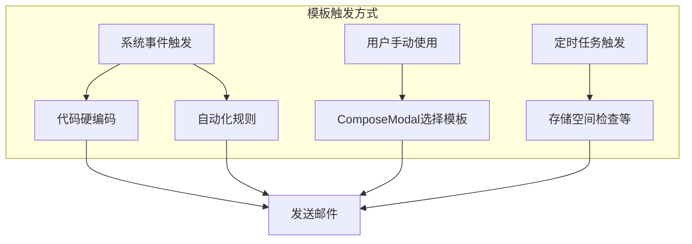

# TalentMail 模板触发与自动化集成设计方案

## 一、问题分析

### 1.1 当前状态

| 模板代码 | 模板名称 | 是否已实现触发 | 触发位置 |
|---------|---------|--------------|---------|
| `verification_code_register` | 注册验证码 | ✅ | [`auth.py:309`](backend/api/auth.py:309) |
| `verification_code_reset_password` | 重置密码验证码 | ✅ | [`auth.py:680`](backend/api/auth.py:680) |
| `welcome_email` | 欢迎新用户 | ❌ | 未实现 |
| `login_alert` | 异地登录提醒 | ❌ | 未实现 |
| `storage_warning` | 存储空间警告 | ❌ | 未实现 |
| `file_share_notification` | 文件分享通知 | ❌ | 未实现 |
| `invite_registration` | 邀请注册 | ❌ | 未实现 |

### 1.2 核心问题

1. **模板与触发逻辑分离**：模板定义在 [`init_template_data.py`](backend/initial/init_template_data.py)，但没有统一的触发机制
2. **缺少可视化配置**：用户无法在界面上设置"什么时候发送什么邮件"
3. **自动化规则没有预设**：虽然有规则引擎，但没有预置的系统规则

---

## 二、解决方案：模板触发的三种方式



### 方式一：系统事件触发（代码级别）

适用于：核心业务流程中的邮件，如注册、登录、密码重置

```python
# 在业务代码中直接调用
from core.mail_service import MailService

# 注册成功后发送欢迎邮件
mail_service = MailService(db)
mail_service.send_template_email(
    template_code="welcome_email",
    to_email=user.email,
    context={"user_name": user.display_name, "login_url": f"{site_url}/login"}
)
```

### 方式二：自动化规则触发

适用于：可配置的邮件触发，如收到特定邮件时自动回复

已有规则引擎 [`rule_engine.py`](backend/core/rule_engine.py) 支持：
- 触发器：`email_received`, `email_sent`, `user_event`, `manual`
- 动作：`send_email` 支持使用模板 `template_code`

### 方式三：用户手动使用

适用于：业务人员（如财务、HR）使用预设模板发送邮件

需要在 ComposeModal 中添加模板选择功能。

---

## 三、系统模板触发点实现

### 3.1 需要实现的触发点

#### 1. 欢迎新用户 (`welcome_email`)
**触发时机**：用户注册成功后
**实现位置**：[`auth.py`](backend/api/auth.py) - `register()` 函数

```python
# auth.py - register() 函数末尾添加
async def register(...):
    # ... 现有注册逻辑 ...
    
    # 发送欢迎邮件
    mail_service = MailService(db)
    await mail_service.send_template_email_async(
        template_code="welcome_email",
        to_email=new_user.email,
        context={
            "user_name": new_user.display_name or new_user.email.split('@')[0],
            "user_email": new_user.email,
            "login_url": f"https://{settings.BASE_DOMAIN}/login"
        }
    )
```

#### 2. 异地登录提醒 (`login_alert`)
**触发时机**：检测到新设备/新IP登录
**实现位置**：[`auth.py`](backend/api/auth.py) - `login()` 函数

```python
# auth.py - login() 函数中添加
async def login(...):
    # ... 现有登录逻辑 ...
    
    # 检查是否新设备/新IP
    is_new_device = check_new_device(user, request)
    
    if is_new_device:
        mail_service = MailService(db)
        await mail_service.send_template_email_async(
            template_code="login_alert",
            to_email=user.recovery_email or user.email,  # 发送到恢复邮箱
            context={
                "user_name": user.display_name,
                "login_time": datetime.now().strftime("%Y-%m-%d %H:%M:%S"),
                "login_ip": request.client.host,
                "login_device": request.headers.get("User-Agent", "Unknown"),
                "login_location": get_location_by_ip(request.client.host)
            }
        )
```

#### 3. 存储空间警告 (`storage_warning`)
**触发时机**：存储使用超过阈值（如80%）
**实现位置**：新建定时任务或在文件上传时检查

```python
# 新建 backend/tasks/storage_check.py
async def check_storage_warnings(db: Session):
    """检查所有用户的存储空间使用情况"""
    users = db.query(User).all()
    mail_service = MailService(db)
    
    for user in users:
        used_percent = calculate_storage_usage(user)
        
        if used_percent >= 80:
            # 检查是否已发送过警告（避免重复发送）
            if not has_sent_warning_recently(user, "storage_80"):
                await mail_service.send_template_email_async(
                    template_code="storage_warning",
                    to_email=user.email,
                    context={
                        "user_name": user.display_name,
                        "used_percent": used_percent,
                        "used_space": format_size(user.storage_used),
                        "total_space": format_size(user.storage_quota),
                        "upgrade_url": f"https://{settings.BASE_DOMAIN}/settings#billing"
                    }
                )
```

#### 4. 文件分享通知 (`file_share_notification`)
**触发时机**：用户创建文件分享
**实现位置**：[`drive.py`](backend/api/drive.py) - 创建分享链接时

```python
# drive.py - create_share() 函数中添加
async def create_share(..., notify_email: Optional[str] = None):
    # ... 现有分享逻辑 ...
    
    if notify_email:
        mail_service = MailService(db)
        await mail_service.send_template_email_async(
            template_code="file_share_notification",
            to_email=notify_email,
            context={
                "sender_name": current_user.display_name,
                "sender_email": current_user.email,
                "file_name": file.filename,
                "file_size": format_size(file.size),
                "share_url": share_link.url,
                "share_password": share_link.password,
                "expires_at": share_link.expires_at.strftime("%Y-%m-%d") if share_link.expires_at else None
            }
        )
```

#### 5. 邀请注册 (`invite_registration`)
**触发时机**：管理员发送邀请
**实现位置**：[`invite.py`](backend/api/invite.py) - 创建邀请码时

```python
# invite.py - create_invite() 函数中添加
async def create_invite(..., send_to_email: Optional[str] = None):
    # ... 现有邀请码创建逻辑 ...
    
    if send_to_email:
        mail_service = MailService(db)
        await mail_service.send_template_email_async(
            template_code="invite_registration",
            to_email=send_to_email,
            context={
                "inviter_name": current_user.display_name,
                "inviter_email": current_user.email,
                "invite_url": f"https://{settings.BASE_DOMAIN}/register?code={invite_code.code}",
                "invite_code": invite_code.code,
                "expires_at": invite_code.expires_at.strftime("%Y-%m-%d") if invite_code.expires_at else None
            }
        )
```

---

## 四、模板触发配置界面设计

### 4.1 在邮件模板管理页面添加"触发设置"

```
┌─────────────────────────────────────────────────────────────────────────────┐
│ 邮件模板管理                                                                │
├─────────────────────────────────────────────────────────────────────────────┤
│                                                                             │
│ [分类筛选 ▼] [全局变量] [+ 新建模板]                                         │
│                                                                             │
│ ┌─────────────────────────────────────────────────────────────────────────┐ │
│ │ [开关] 欢迎新用户                          [认证相关] [系统模板]         │ │
│ │        verification_code_register                                       │ │
│ │        用户注册成功后发送的欢迎邮件                                      │ │
│ │                                                                         │ │
│ │        ⚡ 触发条件：用户注册成功后自动发送                               │ │
│ │        📌 状态：已配置                                                  │ │
│ │                                                                         │ │
│ │        可用变量：                                                       │ │
│ │        [user_name] [user_email] [login_url]                            │ │
│ │                                                    [预览] [编辑] [配置] │ │
│ └─────────────────────────────────────────────────────────────────────────┘ │
│                                                                             │
│ ┌─────────────────────────────────────────────────────────────────────────┐ │
│ │ [开关] 存储空间警告                        [系统通知] [系统模板]         │ │
│ │        storage_warning                                                  │ │
│ │        用户存储空间即将用尽时发送的警告                                  │ │
│ │                                                                         │ │
│ │        ⚡ 触发条件：存储使用超过 [80]%                                  │ │
│ │        📌 状态：已配置                                                  │ │
│ │                                                                         │ │
│ │        可用变量：                                                       │ │
│ │        [user_name] [used_percent] [used_space] [total_space]           │ │
│ │                                                    [预览] [编辑] [配置] │ │
│ └─────────────────────────────────────────────────────────────────────────┘ │
└─────────────────────────────────────────────────────────────────────────────┘
```

### 4.2 触发配置弹窗

点击"配置"按钮后显示：

```
┌─────────────────────────────────────────────────────────────────────────────┐
│ 配置触发条件 - 存储空间警告                                           [×]  │
├─────────────────────────────────────────────────────────────────────────────┤
│                                                                             │
│  触发方式                                                                   │
│  ┌─────────────────────────────────────────────────────────────────────┐   │
│  │ ○ 系统事件（自动）                                                   │   │
│  │   当系统检测到相应事件时自动发送                                     │   │
│  │                                                                     │   │
│  │ ○ 自动化规则                                                        │   │
│  │   通过规则引擎根据条件触发                                           │   │
│  │                                                                     │   │
│  │ ● 定时任务                                                          │   │
│  │   每天/每周定时检查并发送                                            │   │
│  └─────────────────────────────────────────────────────────────────────┘   │
│                                                                             │
│  触发参数                                                                   │
│  ┌─────────────────────────────────────────────────────────────────────┐   │
│  │ 存储使用阈值                                                        │   │
│  │ [80] %                                                              │   │
│  │                                                                     │   │
│  │ 检查频率                                                            │   │
│  │ [每天] ▼  [09:00]                                                   │   │
│  │                                                                     │   │
│  │ □ 避免重复发送（24小时内不重复发送）                                 │   │
│  └─────────────────────────────────────────────────────────────────────┘   │
│                                                                             │
│  发送设置                                                                   │
│  ┌─────────────────────────────────────────────────────────────────────┐   │
│  │ 发送给                                                              │   │
│  │ ● 触发用户本人                                                      │   │
│  │ ○ 指定邮箱：[                                          ]            │   │
│  │ ○ 管理员                                                            │   │
│  └─────────────────────────────────────────────────────────────────────┘   │
│                                                                             │
│                                                    [取消]     [保存配置]    │
└─────────────────────────────────────────────────────────────────────────────┘
```

---

## 五、数据结构设计

### 5.1 模板触发配置表

```python
class TemplateTriggerConfig(Base):
    """模板触发配置表"""
    __tablename__ = "template_trigger_configs"
    
    id = Column(Integer, primary_key=True)
    template_code = Column(String(50), ForeignKey("system_email_templates.code"), unique=True)
    
    # 触发方式
    trigger_mode = Column(String(20), nullable=False)  # system_event / automation_rule / scheduled / manual
    
    # 触发参数（JSON）
    trigger_params = Column(JSON, default=dict)
    # 例如：{"threshold": 80, "check_interval": "daily", "avoid_duplicate_hours": 24}
    
    # 发送目标
    send_to_mode = Column(String(20), default="user")  # user / email / admin
    send_to_email = Column(String(255), nullable=True)  # 当 send_to_mode = email 时使用
    
    # 状态
    is_enabled = Column(Boolean, default=True)
    last_triggered_at = Column(DateTime, nullable=True)
    
    # 关联的自动化规则（如果 trigger_mode = automation_rule）
    automation_rule_id = Column(Integer, ForeignKey("automation_rules.id"), nullable=True)
    
    created_at = Column(DateTime, server_default=func.now())
    updated_at = Column(DateTime, server_default=func.now(), onupdate=func.now())
```

### 5.2 初始化默认触发配置

```python
DEFAULT_TRIGGER_CONFIGS = [
    {
        "template_code": "verification_code_register",
        "trigger_mode": "system_event",
        "trigger_params": {"event": "user.send_verification_code", "purpose": "register"},
        "send_to_mode": "user",
        "is_enabled": True
    },
    {
        "template_code": "verification_code_reset_password",
        "trigger_mode": "system_event",
        "trigger_params": {"event": "user.send_verification_code", "purpose": "reset_password"},
        "send_to_mode": "user",
        "is_enabled": True
    },
    {
        "template_code": "welcome_email",
        "trigger_mode": "system_event",
        "trigger_params": {"event": "user.register_success"},
        "send_to_mode": "user",
        "is_enabled": True
    },
    {
        "template_code": "login_alert",
        "trigger_mode": "system_event",
        "trigger_params": {"event": "user.new_device_login"},
        "send_to_mode": "user",  # 发送到恢复邮箱
        "is_enabled": True
    },
    {
        "template_code": "storage_warning",
        "trigger_mode": "scheduled",
        "trigger_params": {"threshold": 80, "check_interval": "daily", "check_time": "09:00"},
        "send_to_mode": "user",
        "is_enabled": True
    },
    {
        "template_code": "file_share_notification",
        "trigger_mode": "system_event",
        "trigger_params": {"event": "drive.share_created"},
        "send_to_mode": "email",  # 发送给分享接收者
        "is_enabled": True
    },
    {
        "template_code": "invite_registration",
        "trigger_mode": "manual",  # 手动触发（创建邀请时选择是否发送）
        "trigger_params": {},
        "send_to_mode": "email",
        "is_enabled": True
    }
]
```

---

## 六、统一事件发布机制

### 6.1 事件发布器

```python
# backend/core/events.py

from typing import Dict, Any, Optional
from sqlalchemy.orm import Session
import logging

logger = logging.getLogger(__name__)

class EventPublisher:
    """事件发布器 - 统一管理系统事件"""
    
    def __init__(self, db: Session):
        self.db = db
    
    async def publish(self, event_type: str, data: Dict[str, Any], user_id: Optional[int] = None):
        """
        发布事件
        
        Args:
            event_type: 事件类型，如 "user.register_success"
            data: 事件数据
            user_id: 相关用户ID
        """
        logger.info(f"Event published: {event_type}")
        
        # 1. 查找匹配的模板触发配置
        trigger_configs = self._get_matching_configs(event_type)
        
        for config in trigger_configs:
            if not config.is_enabled:
                continue
            
            try:
                await self._send_template_email(config, data, user_id)
            except Exception as e:
                logger.error(f"Failed to send email for event {event_type}: {e}")
        
        # 2. 触发自动化规则（user_event 类型）
        if user_id:
            from core.rule_engine import RuleEngine
            user = self.db.query(User).get(user_id)
            if user:
                rule_engine = RuleEngine(self.db)
                await rule_engine.trigger_user_event(event_type, user, data)
    
    def _get_matching_configs(self, event_type: str):
        """获取匹配的触发配置"""
        from db.models.template import TemplateTriggerConfig
        
        return self.db.query(TemplateTriggerConfig).filter(
            TemplateTriggerConfig.trigger_mode == "system_event",
            TemplateTriggerConfig.is_enabled == True
        ).all()
    
    async def _send_template_email(self, config, data: Dict, user_id: Optional[int]):
        """根据配置发送模板邮件"""
        from core.mail_service import MailService
        
        # 确定收件人
        to_email = self._resolve_recipient(config, data, user_id)
        if not to_email:
            return
        
        mail_service = MailService(self.db)
        await mail_service.send_template_email_async(
            template_code=config.template_code,
            to_email=to_email,
            context=data
        )
        
        # 更新最后触发时间
        config.last_triggered_at = datetime.utcnow()
        self.db.commit()
    
    def _resolve_recipient(self, config, data: Dict, user_id: Optional[int]) -> Optional[str]:
        """解析收件人"""
        if config.send_to_mode == "user" and user_id:
            user = self.db.query(User).get(user_id)
            return user.email if user else None
        elif config.send_to_mode == "email":
            return config.send_to_email or data.get("notify_email")
        elif config.send_to_mode == "admin":
            # 获取管理员邮箱
            admin = self.db.query(User).filter(User.role == "admin").first()
            return admin.email if admin else None
        return None


# 全局事件发布器实例
_event_publisher = None

def get_event_publisher(db: Session) -> EventPublisher:
    global _event_publisher
    if _event_publisher is None or _event_publisher.db != db:
        _event_publisher = EventPublisher(db)
    return _event_publisher
```

### 6.2 在业务代码中使用事件发布器

```python
# auth.py

from core.events import get_event_publisher

@router.post("/register")
async def register(user_data: UserCreate, db: Session = Depends(get_db)):
    # ... 注册逻辑 ...
    
    # 发布注册成功事件
    event_publisher = get_event_publisher(db)
    await event_publisher.publish(
        event_type="user.register_success",
        data={
            "user_name": new_user.display_name or new_user.email.split('@')[0],
            "user_email": new_user.email,
            "login_url": f"https://{settings.BASE_DOMAIN}/login"
        },
        user_id=new_user.id
    )
    
    return {"message": "注册成功"}
```

---

## 七、实现计划

### 阶段一：后端基础设施

- [ ] 创建 `template_trigger_configs` 表迁移
- [ ] 实现 `EventPublisher` 事件发布器
- [ ] 修改 `MailService` 添加异步方法 `send_template_email_async`
- [ ] 初始化默认触发配置数据

### 阶段二：接入系统事件

- [ ] 在 `auth.py` 注册成功处发布 `user.register_success` 事件
- [ ] 在 `auth.py` 登录处检测新设备并发布 `user.new_device_login` 事件
- [ ] 在 `drive.py` 创建分享处发布 `drive.share_created` 事件
- [ ] 在 `invite.py` 创建邀请处支持发送邀请邮件

### 阶段三：定时任务

- [ ] 实现存储空间检查定时任务
- [ ] 集成 APScheduler 或 Celery 调度框架

### 阶段四：前端配置界面

- [ ] 在 [`EmailTemplates.vue`](frontend/app/components/settings/EmailTemplates.vue) 添加"配置触发"功能
- [ ] 创建 `TemplateTriggerConfig.vue` 触发配置弹窗
- [ ] 添加触发配置的 CRUD API

---

## 八、总结

本设计解决了以下问题：

1. **模板触发机制**：
   - 系统事件触发（代码级别）
   - 自动化规则触发（可配置）
   - 定时任务触发（如存储检查）
   - 手动使用（用户在 ComposeModal 选择）

2. **统一事件发布**：
   - `EventPublisher` 统一管理事件发布
   - 业务代码只需发布事件，触发逻辑由配置决定

3. **可视化配置**：
   - 前端可以查看和修改触发条件
   - 支持启用/禁用特定模板的触发

4. **与现有自动化规则集成**：
   - 事件同时触发用户自定义的自动化规则
   - 保持系统的灵活性和可扩展性