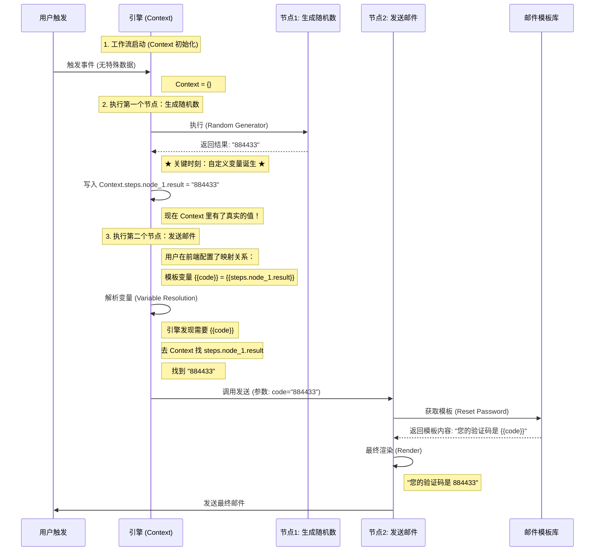

# 验证码漂流记：一个随机数的一生

您问到了点子上！“随机验证码”是理解整个变量系统的最好例子。

我们通过一个实际场景：**“用户点击重置密码 -> 生成随机码 -> 发送邮件”** 来追踪数据的流向。

## 核心原理解答

### 1. 随机验证码怎么来？
**答：通过“工具节点”生成。**
我们在工作流编辑器里提供一个 **“生成随机字符串 (Generate Random String)”** 的节点。
您拖进去，设置长度为 6，全数字。
它跑完之后，就会产出一个值（比如 `884433`），放在 `steps` 结果里。

### 2. 这个变量没存数据库，后面怎么用？ (自定义变量)
**答：它存在 Context (内存) 里。**
只要工作流还在跑，上一步的结果 `884433` 就一直活着。
下一个节点（发邮件）可以直接通过 `{{steps.generate_code_node.result}}` 引用它。

### 3. 邮件模板怎么知道 code 是生成的那个数？
**答：靠“连线” (映射)。**
在发邮件节点的配置面板里：
*   左边显示模板需要的变量：`code` (系统自动分析出来的)
*   右边显示可用的变量：[下拉菜单] -> 选择 `节点1: 生成随机码的结果`

您这一选，连接就建立好了。

---

## 结论

1.  **随机数**：由专门的“工具节点”现场生产。
2.  **自定义变量**：就是节点产生的结果，临时存在内存 Context 中。
3.  **模板使用**：通过配置面板的“映射”，把内存里的临时变量，赋值给模板里的参数。

这样解释，逻辑通顺了吗？