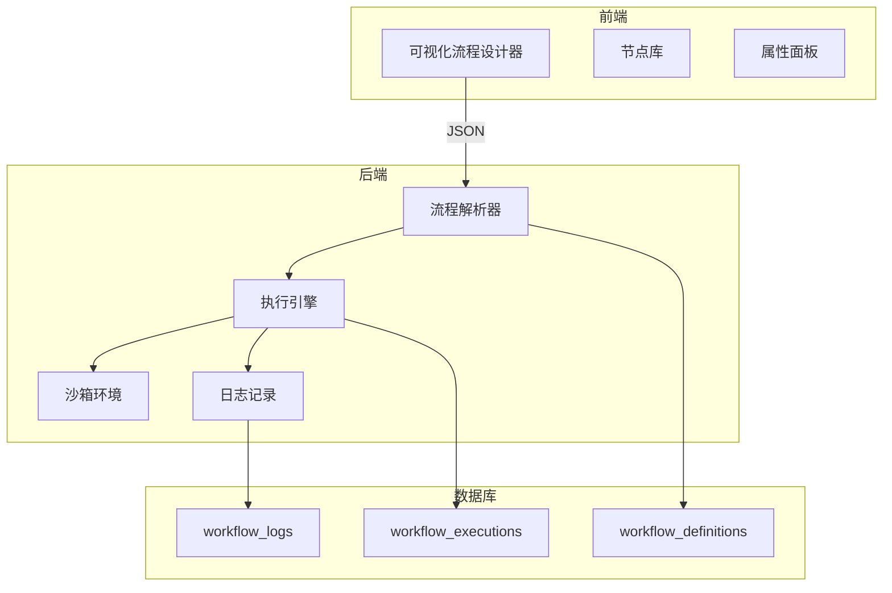

# TalentMail 可视化工作流引擎设计方案

## 一、概念解析

用户的想法是：**在网页上设计流程 → 生成/存储代码 → 后端动态执行**

这本质上是一个 **低代码工作流引擎**，类似于：
- **Zapier** / **n8n** / **Make (Integromat)** - 自动化工作流
- **Node-RED** - 可视化编程
- **Temporal** / **Airflow** - 工作流编排

---

## 二、可行性分析

### 2.1 优势

| 优势 | 说明 |
|-----|------|
| ✅ 灵活性极高 | 用户可以自定义任何业务逻辑 |
| ✅ 无需发布更新 | 修改流程不需要重新部署后端 |
| ✅ 非技术人员可用 | 通过可视化界面拖拽节点 |
| ✅ 快速迭代 | 业务逻辑变更即时生效 |

### 2.2 技术挑战

| 挑战 | 解决方案 |
|-----|---------|
| ⚠️ 安全性 | 使用沙箱执行、限制可用函数、代码审计 |
| ⚠️ 性能 | 预编译、缓存、超时控制 |
| ⚠️ 调试困难 | 完善的日志、回放、断点调试 |
| ⚠️ 复杂度 | 分阶段实现，先做 JSON DSL，再考虑代码生成 |

### 2.3 推荐方案

**方案一：JSON DSL（领域特定语言）** ⭐ 推荐
- 流程以 JSON 描述，后端解释执行
- 安全、可控、易于实现
- 示例：现有的自动化规则引擎就是这种模式

**方案二：动态代码执行**
- 存储 Python/JavaScript 代码，沙箱执行
- 灵活但需要严格的安全控制
- 适合高级用户

**方案三：混合模式** ⭐⭐ 最优
- 基础流程用 JSON DSL（安全、简单）
- 高级逻辑支持表达式/代码片段（灵活）

---

## 三、架构设计

### 3.1 整体架构



### 3.2 流程定义格式（JSON DSL）

```json
{
  "id": "workflow_001",
  "name": "新用户欢迎流程",
  "version": 1,
  "trigger": {
    "type": "event",
    "event": "user.register_success"
  },
  "nodes": [
    {
      "id": "node_1",
      "type": "condition",
      "name": "检查用户类型",
      "config": {
        "expression": "{{ user.role == 'vip' }}"
      },
      "next": {
        "true": "node_2",
        "false": "node_3"
      }
    },
    {
      "id": "node_2",
      "type": "send_email",
      "name": "发送VIP欢迎邮件",
      "config": {
        "template_code": "welcome_vip",
        "to": "{{ user.email }}",
        "variables": {
          "user_name": "{{ user.display_name }}",
          "vip_benefits": "{{ get_vip_benefits(user.vip_level) }}"
        }
      },
      "next": "node_4"
    },
    {
      "id": "node_3",
      "type": "send_email",
      "name": "发送普通欢迎邮件",
      "config": {
        "template_code": "welcome_email",
        "to": "{{ user.email }}",
        "variables": {
          "user_name": "{{ user.display_name }}"
        }
      },
      "next": "node_4"
    },
    {
      "id": "node_4",
      "type": "delay",
      "name": "等待3天",
      "config": {
        "duration": "3d"
      },
      "next": "node_5"
    },
    {
      "id": "node_5",
      "type": "condition",
      "name": "检查是否活跃",
      "config": {
        "expression": "{{ user.login_count > 0 }}"
      },
      "next": {
        "true": "end",
        "false": "node_6"
      }
    },
    {
      "id": "node_6",
      "type": "send_email",
      "name": "发送激活提醒",
      "config": {
        "template_code": "activation_reminder",
        "to": "{{ user.email }}"
      },
      "next": "end"
    }
  ]
}
```

### 3.3 节点类型

| 节点类型 | 说明 | 配置项 |
|---------|------|--------|
| `trigger` | 触发器 | event / schedule / webhook |
| `condition` | 条件判断 | expression |
| `send_email` | 发送邮件 | template_code, to, variables |
| `delay` | 延迟等待 | duration (1h, 3d, 1w) |
| `http_request` | HTTP 请求 | url, method, headers, body |
| `set_variable` | 设置变量 | name, value |
| `loop` | 循环 | items, do |
| `parallel` | 并行执行 | branches |
| `code` | 自定义代码 | language, code (沙箱执行) |
| `end` | 结束 | - |

---

## 四、可视化设计器界面

### 4.1 主界面布局

```
┌─────────────────────────────────────────────────────────────────────────────┐
│ 工作流设计器 - 新用户欢迎流程                              [保存] [发布] [×] │
├──────────────────┬───────────────────────────────────────┬──────────────────┤
│                  │                                       │                  │
│  📦 节点库       │           画布区域                    │  ⚙️ 属性面板    │
│                  │                                       │                  │
│  ┌────────────┐  │     ┌─────────┐                      │  节点: 条件判断  │
│  │ 📧 发送邮件│  │     │ 开始    │                      │                  │
│  └────────────┘  │     └────┬────┘                      │  名称:           │
│  ┌────────────┐  │          │                           │  [检查用户类型]  │
│  │ ⏱️ 延迟    │  │     ┌────▼────┐                      │                  │
│  └────────────┘  │     │ 条件    │ ← 选中               │  条件表达式:     │
│  ┌────────────┐  │     └────┬────┘                      │  [user.role ==   │
│  │ ❓ 条件    │  │      是 │   否                       │   'vip']         │
│  └────────────┘  │    ┌────▼────┐ ┌────────┐            │                  │
│  ┌────────────┐  │    │VIP邮件 │ │普通邮件│            │  帮助:           │
│  │ 🔁 循环    │  │    └────┬────┘ └───┬────┘            │  支持变量引用    │
│  └────────────┘  │         └────┬─────┘                 │  {{user.xxx}}    │
│  ┌────────────┐  │         ┌────▼────┐                  │                  │
│  │ 🌐 HTTP   │  │         │ 延迟3天 │                  │                  │
│  └────────────┘  │         └────┬────┘                  │                  │
│  ┌────────────┐  │         ┌────▼────┐                  │                  │
│  │ 💻 代码    │  │         │  结束   │                  │                  │
│  └────────────┘  │         └─────────┘                  │                  │
│                  │                                       │                  │
├──────────────────┴───────────────────────────────────────┴──────────────────┤
│  ▶ 测试运行  │  📋 执行历史  │  📊 统计                                     │
└─────────────────────────────────────────────────────────────────────────────┘
```

### 4.2 交互方式

1. **拖拽节点**：从左侧节点库拖到画布
2. **连接节点**：点击节点输出点，拖动到目标节点
3. **配置属性**：点击节点，右侧显示属性面板
4. **测试运行**：提供测试数据，模拟执行流程
5. **查看日志**：每次执行的详细日志

---

## 五、后端执行引擎设计

### 5.1 数据库模型

```python
class WorkflowDefinition(Base):
    """工作流定义"""
    __tablename__ = "workflow_definitions"
    
    id = Column(Integer, primary_key=True)
    name = Column(String(100), nullable=False)
    description = Column(Text)
    version = Column(Integer, default=1)
    
    # 触发器配置
    trigger_type = Column(String(50))  # event / schedule / webhook / manual
    trigger_config = Column(JSON)
    
    # 流程定义（JSON）
    nodes = Column(JSON, nullable=False)
    
    # 状态
    is_active = Column(Boolean, default=False)
    is_published = Column(Boolean, default=False)
    
    # 所有者（可以是用户或系统）
    owner_id = Column(Integer, ForeignKey("users.id"), nullable=True)
    is_system = Column(Boolean, default=False)
    
    # 统计
    execution_count = Column(Integer, default=0)
    last_executed_at = Column(DateTime)
    
    created_at = Column(DateTime, server_default=func.now())
    updated_at = Column(DateTime, onupdate=func.now())


class WorkflowExecution(Base):
    """工作流执行记录"""
    __tablename__ = "workflow_executions"
    
    id = Column(Integer, primary_key=True)
    workflow_id = Column(Integer, ForeignKey("workflow_definitions.id"))
    
    # 触发信息
    trigger_type = Column(String(50))
    trigger_data = Column(JSON)
    
    # 执行状态
    status = Column(String(20))  # running / completed / failed / cancelled
    current_node_id = Column(String(50))
    
    # 上下文（变量存储）
    context = Column(JSON, default=dict)
    
    # 执行结果
    result = Column(JSON)
    error_message = Column(Text)
    
    # 时间
    started_at = Column(DateTime)
    completed_at = Column(DateTime)
    
    # 延迟恢复（如果有 delay 节点）
    resume_at = Column(DateTime)  # 计划恢复时间


class WorkflowNodeLog(Base):
    """节点执行日志"""
    __tablename__ = "workflow_node_logs"
    
    id = Column(Integer, primary_key=True)
    execution_id = Column(Integer, ForeignKey("workflow_executions.id"))
    
    node_id = Column(String(50))
    node_type = Column(String(50))
    node_name = Column(String(100))
    
    # 输入输出
    input_data = Column(JSON)
    output_data = Column(JSON)
    
    # 状态
    status = Column(String(20))  # success / failed / skipped
    error_message = Column(Text)
    
    # 时间
    started_at = Column(DateTime)
    completed_at = Column(DateTime)
    duration_ms = Column(Integer)
```

### 5.2 执行引擎核心

```python
# backend/core/workflow_engine.py

class WorkflowEngine:
    """工作流执行引擎"""
    
    def __init__(self, db: Session):
        self.db = db
        self.node_handlers = self._register_handlers()
    
    def _register_handlers(self) -> Dict[str, callable]:
        """注册节点处理器"""
        return {
            "condition": self._handle_condition,
            "send_email": self._handle_send_email,
            "delay": self._handle_delay,
            "http_request": self._handle_http_request,
            "set_variable": self._handle_set_variable,
            "loop": self._handle_loop,
            "parallel": self._handle_parallel,
            "code": self._handle_code,  # 沙箱执行
        }
    
    async def execute(self, workflow_id: int, trigger_data: Dict) -> WorkflowExecution:
        """执行工作流"""
        workflow = self.db.query(WorkflowDefinition).get(workflow_id)
        if not workflow:
            raise ValueError(f"Workflow not found: {workflow_id}")
        
        # 创建执行记录
        execution = WorkflowExecution(
            workflow_id=workflow_id,
            trigger_type=workflow.trigger_type,
            trigger_data=trigger_data,
            status="running",
            context=trigger_data.copy(),
            started_at=datetime.utcnow()
        )
        self.db.add(execution)
        self.db.commit()
        
        try:
            # 从第一个节点开始执行
            await self._execute_node(workflow.nodes[0], execution)
            
            execution.status = "completed"
            execution.completed_at = datetime.utcnow()
        except Exception as e:
            execution.status = "failed"
            execution.error_message = str(e)
            execution.completed_at = datetime.utcnow()
        
        self.db.commit()
        return execution
    
    async def _execute_node(self, node: Dict, execution: WorkflowExecution):
        """执行单个节点"""
        node_id = node["id"]
        node_type = node["type"]
        
        # 记录日志
        log = WorkflowNodeLog(
            execution_id=execution.id,
            node_id=node_id,
            node_type=node_type,
            node_name=node.get("name", ""),
            input_data=execution.context,
            started_at=datetime.utcnow()
        )
        
        try:
            handler = self.node_handlers.get(node_type)
            if not handler:
                raise ValueError(f"Unknown node type: {node_type}")
            
            # 执行节点
            result = await handler(node, execution)
            
            log.status = "success"
            log.output_data = result
            
            # 确定下一个节点
            next_node_id = self._get_next_node(node, result)
            
            if next_node_id and next_node_id != "end":
                next_node = self._find_node(execution.workflow.nodes, next_node_id)
                if next_node:
                    await self._execute_node(next_node, execution)
        
        except Exception as e:
            log.status = "failed"
            log.error_message = str(e)
            raise
        
        finally:
            log.completed_at = datetime.utcnow()
            log.duration_ms = int((log.completed_at - log.started_at).total_seconds() * 1000)
            self.db.add(log)
    
    async def _handle_condition(self, node: Dict, execution: WorkflowExecution) -> Dict:
        """处理条件节点"""
        expression = node["config"]["expression"]
        result = self._evaluate_expression(expression, execution.context)
        return {"result": result}
    
    async def _handle_send_email(self, node: Dict, execution: WorkflowExecution) -> Dict:
        """处理发送邮件节点"""
        from core.mail_service import MailService
        
        config = node["config"]
        to_email = self._render_value(config["to"], execution.context)
        template_code = config["template_code"]
        
        variables = {}
        for key, value in config.get("variables", {}).items():
            variables[key] = self._render_value(value, execution.context)
        
        mail_service = MailService(self.db)
        success = await mail_service.send_template_email_async(
            template_code=template_code,
            to_email=to_email,
            context=variables
        )
        
        return {"sent": success, "to": to_email, "template": template_code}
    
    async def _handle_delay(self, node: Dict, execution: WorkflowExecution) -> Dict:
        """处理延迟节点"""
        duration = node["config"]["duration"]
        resume_at = self._parse_duration(duration)
        
        # 保存恢复时间，由调度器恢复执行
        execution.status = "waiting"
        execution.resume_at = resume_at
        execution.current_node_id = node["id"]
        self.db.commit()
        
        # 抛出特殊异常，中断当前执行
        raise WorkflowDelayException(resume_at)
    
    async def _handle_code(self, node: Dict, execution: WorkflowExecution) -> Dict:
        """处理自定义代码节点（沙箱执行）"""
        code = node["config"]["code"]
        language = node["config"].get("language", "python")
        
        # 使用 RestrictedPython 或类似库安全执行
        result = await self._execute_sandboxed_code(code, execution.context, language)
        
        return {"result": result}
    
    def _evaluate_expression(self, expression: str, context: Dict) -> bool:
        """安全地评估表达式"""
        # 移除 {{ }} 包装
        expr = expression.strip()
        if expr.startswith("{{") and expr.endswith("}}"):
            expr = expr[2:-2].strip()
        
        # 使用 SimpleEval 或类似库安全执行
        from simpleeval import simple_eval
        return simple_eval(expr, names=context)
    
    def _render_value(self, template: str, context: Dict) -> str:
        """渲染模板值"""
        import re
        def replace(match):
            key = match.group(1).strip()
            return str(context.get(key, match.group(0)))
        return re.sub(r'\{\{\s*(.+?)\s*\}\}', replace, template)
```

### 5.3 安全沙箱执行

```python
# backend/core/sandbox.py

from RestrictedPython import compile_restricted, safe_builtins
from RestrictedPython.Eval import default_guarded_getattr

class CodeSandbox:
    """代码沙箱执行环境"""
    
    # 允许的内置函数
    ALLOWED_BUILTINS = {
        'True': True,
        'False': False,
        'None': None,
        'abs': abs,
        'bool': bool,
        'float': float,
        'int': int,
        'len': len,
        'list': list,
        'dict': dict,
        'str': str,
        'max': max,
        'min': min,
        'sum': sum,
        'round': round,
        'sorted': sorted,
        'range': range,
        'enumerate': enumerate,
        'zip': zip,
    }
    
    # 禁止的操作
    FORBIDDEN_NAMES = {'eval', 'exec', 'compile', 'open', 'import', '__import__', 'globals', 'locals'}
    
    def __init__(self, timeout: int = 5):
        self.timeout = timeout
    
    def execute(self, code: str, context: Dict[str, Any]) -> Any:
        """
        安全执行代码
        
        Args:
            code: Python 代码
            context: 可用的变量
        
        Returns:
            执行结果
        """
        # 检查禁止的操作
        for name in self.FORBIDDEN_NAMES:
            if name in code:
                raise SecurityError(f"Forbidden operation: {name}")
        
        # 编译代码
        byte_code = compile_restricted(code, '<inline>', 'exec')
        
        # 准备执行环境
        restricted_globals = {
            '__builtins__': self.ALLOWED_BUILTINS,
            '_getattr_': default_guarded_getattr,
            '_write_': lambda x: x,
            '_getitem_': lambda obj, key: obj[key],
            **context
        }
        
        restricted_locals = {}
        
        # 执行代码（带超时）
        import signal
        
        def timeout_handler(signum, frame):
            raise TimeoutError(f"Code execution timeout ({self.timeout}s)")
        
        signal.signal(signal.SIGALRM, timeout_handler)
        signal.alarm(self.timeout)
        
        try:
            exec(byte_code, restricted_globals, restricted_locals)
        finally:
            signal.alarm(0)
        
        # 返回 result 变量（如果有）
        return restricted_locals.get('result')
```

---

## 六、与现有系统的集成

### 6.1 与自动化规则引擎的关系

```
┌─────────────────────────────────────────────────────────────────┐
│                    TalentMail 自动化体系                         │
├─────────────────────────────────────────────────────────────────┤
│                                                                 │
│  ┌─────────────────┐      ┌─────────────────┐                   │
│  │ 自动化规则引擎  │      │   工作流引擎    │                   │
│  │ (RuleEngine)    │      │ (WorkflowEngine)│                   │
│  ├─────────────────┤      ├─────────────────┤                   │
│  │ - 简单条件匹配  │      │ - 复杂流程编排  │                   │
│  │ - 单次动作执行  │      │ - 多步骤执行    │                   │
│  │ - 即时响应      │      │ - 延迟/定时     │                   │
│  │ - JSON 配置     │      │ - 可视化设计    │                   │
│  └────────┬────────┘      └────────┬────────┘                   │
│           │                        │                            │
│           └──────────┬─────────────┘                            │
│                      │                                          │
│               ┌──────▼──────┐                                   │
│               │  统一触发器  │                                   │
│               │ EventBus    │                                   │
│               └──────┬──────┘                                   │
│                      │                                          │
│  ┌───────────────────┼───────────────────┐                      │
│  │                   │                   │                      │
│  ▼                   ▼                   ▼                      │
│ 邮件事件          用户事件            定时事件                  │
│                                                                 │
└─────────────────────────────────────────────────────────────────┘
```

### 6.2 渐进式迁移策略

1. **阶段一**：保留现有 RuleEngine，新增 WorkflowEngine
2. **阶段二**：在前端提供"简单规则"和"高级流程"两种编辑器
3. **阶段三**：逐步将简单规则迁移到工作流

---

## 七、实现计划

### 第一阶段：基础设施（2周）

- [ ] 设计并创建数据库模型（workflow_definitions, workflow_executions, workflow_node_logs）
- [ ] 实现 WorkflowEngine 核心执行逻辑
- [ ] 实现基础节点处理器（condition, send_email, set_variable, delay）
- [ ] 实现沙箱代码执行环境

### 第二阶段：可视化设计器（3周）

- [ ] 集成拖拽库（如 vue-flow / react-flow）
- [ ] 实现节点库组件
- [ ] 实现属性面板
- [ ] 实现流程保存/加载

### 第三阶段：高级功能（2周）

- [ ] 实现延迟恢复机制（结合 Celery/APScheduler）
- [ ] 实现 HTTP 请求节点
- [ ] 实现循环和并行节点
- [ ] 实现测试运行和日志查看

### 第四阶段：集成与优化（1周）

- [ ] 与现有事件系统集成
- [ ] 添加工作流模板（预设流程）
- [ ] 性能优化和监控

---

## 八、技术选型

### 前端
- **流程设计器**：[Vue Flow](https://vueflow.dev/) 或 [Drawflow](https://github.com/jerosoler/Drawflow)
- **表达式编辑**：Monaco Editor（轻量版）

### 后端
- **表达式引擎**：[SimpleEval](https://github.com/danthedeckie/simpleeval)
- **沙箱执行**：[RestrictedPython](https://restrictedpython.readthedocs.io/)
- **任务调度**：Celery + Redis 或 APScheduler

---

## 九、总结

用户的想法完全可行！我们可以通过以下方式实现：

1. **JSON DSL** 定义流程结构（安全、可控）
2. **可视化设计器** 让非技术人员设计流程
3. **执行引擎** 解释执行流程定义
4. **沙箱环境** 安全执行自定义代码
5. **与现有系统集成** 复用邮件模板、自动化规则等

这个功能将使 TalentMail 从一个邮件系统升级为一个 **可编程的自动化平台**！